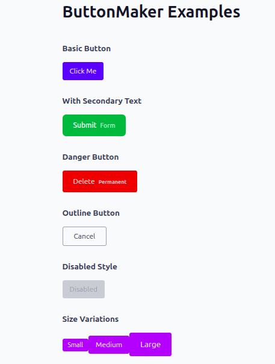

# 📦 react-button-maker
A simple and flexible React component for creating fully customizable buttons with optional text overlays. Build buttons your way with complete styling control.





---

## ✨ Features

- **🎨 Full Customization** — Style buttons and text exactly as you need them
- **🧩 Framework Agnostic** — Works seamlessly with Tailwind CSS, styled-components, or plain CSS
- **⚡ Lightweight** — Minimal dependencies, maximum performance
- **📝 Flexible Text** — Add primary and secondary text labels
- **♻️ Modern React** — Built for React 19
- **🎯 Zero Default Styles** — You have complete control over appearance
- **📘 TypeScript Support** — Full type safety with React.ButtonHTMLAttributes

---

## 📦 Installation

Install the package using your preferred package manager:

```bash
npm install react-button-maker
```

```bash
yarn add react-button-maker
```

---

## 🚀 Quick Start

**Step 1: Import the component**

```javascript
import ButtonMaker from "react-button-maker";
```

**Step 2: Add to your component**

```jsx
<ButtonMaker
  label="Click Me"
  text="Secondary"
  buttonStyle="bg-blue-600 text-white px-4 py-2 rounded"
  textStyle="text-gray-200 text-sm"
  onClick={() => console.log("Clicked")}
/>
```

---

## 📋 Props Reference

| Prop | Type | Required | Description |
|------|------|----------|-------------|
| `label` | `string` | ✓ | Main button text displayed inside the button |
| `text` | `string` | — | Optional secondary text rendered inline with the button |
| `buttonStyle` | `string` | — | CSS classes or inline styles for the button element |
| `textStyle` | `string` | — | CSS classes or inline styles for the optional text element |
| `onClick` | `() => void` | — | Callback function triggered on button click |
| `disabled` | `boolean` | — | Disable the button (standard HTML attribute) |
| `type` | `"button" \| "submit" \| "reset"` | — | Button type (standard HTML attribute) |
| `...rest` | `React.ButtonHTMLAttributes` | — | All standard HTML button attributes supported |

---

## 💡 Examples

### Using Tailwind CSS

Create a polished button with Tailwind utilities:

```jsx
<ButtonMaker 
  label="Submit"
  text="Now"
  buttonStyle="bg-green-600 text-white px-6 py-3 rounded-lg hover:bg-green-700 transition-colors"
  textStyle="text-yellow-200 ml-2 text-sm"
  onClick={() => alert("Form submitted!")}
/>
```

### Using Plain CSS

Define custom styles in your stylesheet:

```jsx
<ButtonMaker 
  label="Save"
  text="Changes"
  buttonStyle="custom-btn"
  textStyle="secondary-label"
  onClick={handleSave}
/>
```

**styles.css:**

```css
.custom-btn {
  background-color: #333;
  color: #ffffff;
  padding: 10px 16px;
  border-radius: 6px;
  border: none;
  cursor: pointer;
  font-weight: 500;
  transition: background-color 0.2s ease;
}

.custom-btn:hover {
  background-color: #555;
}

.secondary-label {
  font-size: 12px;
  color: #999;
  margin-left: 8px;
  opacity: 0.9;
}
```

### TypeScript Usage

Full type safety in your React/TypeScript project:

```typescriptreact
import ButtonMaker from "react-button-maker";

function App() {
  const handleClick = () => {
    console.log("Button clicked!");
  };

  return (
    <ButtonMaker
      label="Click Me"
      buttonStyle="bg-blue-600 text-white px-4 py-2 rounded hover:bg-blue-700"
      onClick={handleClick}
      disabled={false}
      type="button"
      aria-label="Submit button"
    />
  );
}

export default App;
```

### Advanced: Standard HTML Attributes

Use any standard button HTML attributes:

```jsx
<ButtonMaker
  label="Delete"
  text="Permanent"
  buttonStyle="bg-red-600 text-white px-6 py-3 rounded"
  onClick={handleDelete}
  disabled={isLoading}
  type="button"
  aria-label="Delete item permanently"
  data-testid="delete-button"
  title="This action cannot be undone"
/>
```

---

## 🛠️ Development

### Setup

Clone and install the repository:

```bash
git clone https://github.com/Q-Niranjan/react-button-maker
cd react-button-maker
npm install
```

### Build

Build the package for distribution:

```bash
npm run build
```
---

## 📄 License

MIT License © 2025

You're free to use this package in personal and commercial projects. See the LICENSE file for details.

---

## 🤝 Contributing

We welcome contributions! Feel free to submit issues or pull requests to help improve react-button-maker.
